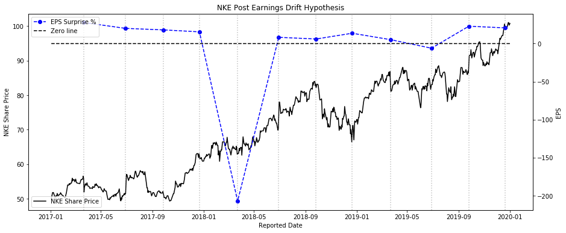
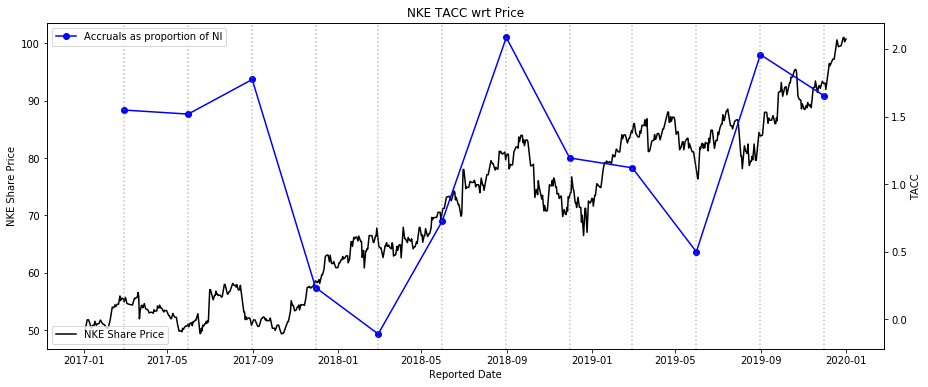
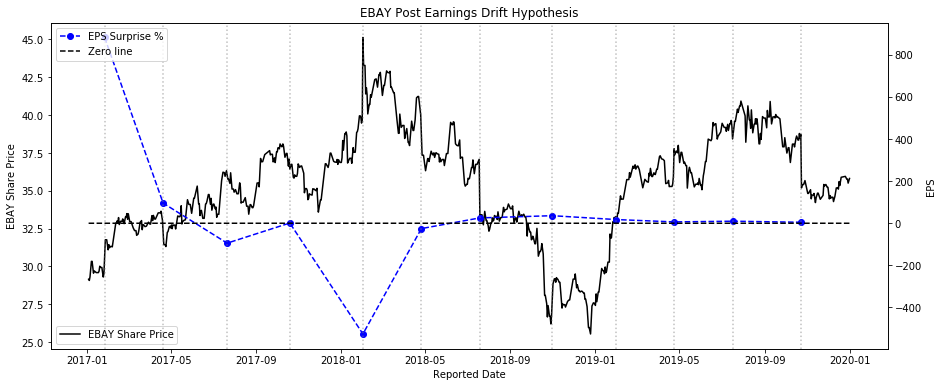
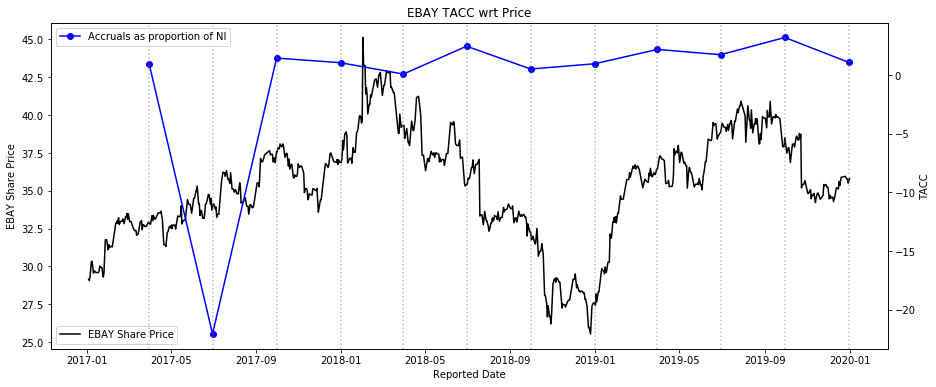
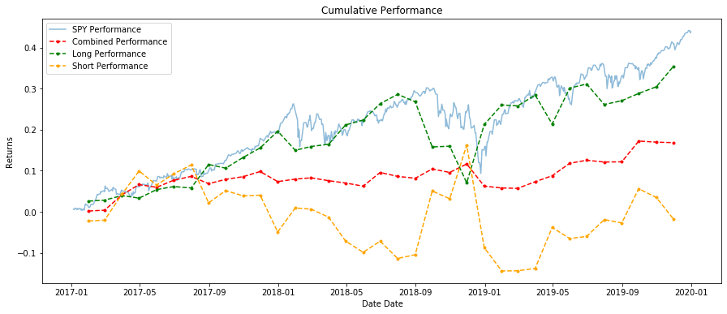
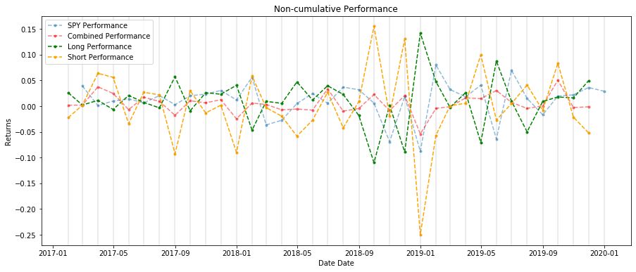

# Post Earnings Announcement Drift (PEAD) & Accrual Anomaly

The aim is to examine if the [Accrual anomaly (Balakrishnan et al. 2009)](https://papers.ssrn.com/sol3/papers.cfm?abstract_id=1793364) and [PEAD (Sloan et al. 2011)](https://papers.ssrn.com/sol3/papers.cfm?abstract_id=1510321) still exist today. 

"The Accrual Anomaly" (Balakrishnan et al. 2009) questioned the persistence of stellar earnings performances that were driven by accruals. Secondly, "Post Loss/Profit Announcement Drift" (Sloan et al. 2011) which attempted to understand why prices drift after earnings announcements, even when the underlying fundamentals of the company have not shifted significantly.

Concretely, both papers explored ideas that oppose the efficient markets hypothesis. I was curious if these inefficiencies/anomalies still exist today and if so, are they viable strategies. With some visualisations, we observe some semblance of the anomalies.

#### Nike

*TACC: Total Accruals

#### Ebay

#### About my data
I've opted to exclude the months of COVID-19 due to extreme volatility in the market and influx of liquidity introduced. 
Due to data unavailability, the investigated timeframe is only from 1st Jan 2017 - 1st Jan 2020.  
The holding period for each stock will be monthly and the rebalancing is done at the end of each month.  

Given that [most fund managers lag index funds](https://www.marketwatch.com/story/why-way-fewer-actively-managed-funds-beat-the-sp-than-we-thought-2017-04-24), I thought SPY would be a good benchmark to compare the relative performance.  

For full code, refer to either of the following:
1. [pead_accruals.ipynb](pead_accruals.ipynb) - graphing functions are included 
2. [pead_accruals.py](pead_accruals.py) - written functionally with full documentation for each function

## Results 
#### Cumulative Performance

#### Non-cumulative Performance

#### Observations
1. The top 10% and bottom 10% of stocks appear to be inversely related between 2018-06 to 2019-01.
2. When we factor in transaction costs (spreads & fx), even if we only go long, the returns will be significant less than SPY. 
3. The strategy is missing key growth stocks (due to unavailable data) that have contributed to SPY's performance and thus when we include them, the results could change drastically. (Refer to Appendix A)

Does the strategy work? Yes, but one would be far better off passively holding SPY. :sweat_smile:

## Resources required to replicate findings
1. Fundamental data - cashflow statements, net income, amortization and depreciation
2. Price data
3. Estimates data 

Feel free to clone/branch the repo and conduct your own investigation! :smile:

## Future Developments
I'll be continually updating more code to investigate more anomalies found by researchers. So if you're interested, you could check in again in a couple of weeks/months. Cheers!

## Appendix A 
Notable missing tickers - GOOGL, FB, AAPL, MSFT.  
Full list of missing tickers  
<code>
['AAL', 'AAPL', 'ABC', 'ABMD', 'ABT', 'ACN', 'ADBE', 'ADM', 'ADP', 'ADS', 'AEP', 'AFL', 'AJG', 'AKAM', 'ALGN', 'ALK', 'ALL', 'ALLE', 'ALXN', 'AMCR', 'AMD', 'AME', 'AMGN', 'AMP', 'AMT', 'AMZN', 'ANTM', 'AON', 'AOS', 'APA', 'APD', 'APH', 'APTV', 'ARE', 'ATO', 'AVB', 'AVGO', 'AVY', 'AWK', 'AXP', 'AZO', 'BA', 'BAC', 'BAX', 'BDX', 'BEN', 'BF.B', 'BIIB', 'BK', 'BKR', 'BLK', 'BLL', 'BMY', 'BR', 'BRK.B', 'BSX', 'BWA', 'BXP', 'C', 'CAG', 'CAH', 'CARR', 'CAT', 'CB', 'CCI', 'CCL', 'CDNS', 'CDW', 'CE', 'CERN', 'CF', 'CFG', 'CHD', 'CHRW', 'CHTR', 'CI', 'CINF', 'CLX', 'CMA', 'CMCSA', 'CME', 'CMG', 'CMI', 'CMS', 'CNC', 'COF', 'COG', 'COO', 'COP', 'COST', 'COTY', 'CPB', 'CRM', 'CSCO', 'CSX', 'CTAS', 'CTSH', 'CTVA', 'CTXS', 'CXO', 'DAL', 'DD', 'DFS', 'DG', 'DGX', 'DHI', 'DHR', 'DIS', 'DLR', 'DLTR', 'DOV', 'DOW', 'DPZ', 'DRE', 'DRI', 'DTE', 'EA', 'EBAY', 'ECL', 'EFX', 'EIX', 'EL', 'EMN', 'EMR', 'EQIX', 'EQR', 'ESS', 'ETFC', 'ETN', 'ETR', 'EW', 'EXC', 'EXR', 'F', 'FAST', 'FB', 'FBHS', 'FCX', 'FDX', 'FFIV', 'FITB', 'FLIR', 'FLS', 'FMC', 'FOX', 'FOXA', 'FRC', 'FRT', 'FTI', 'FTV', 'GD', 'GE', 'GILD', 'GIS', 'GL', 'GLW', 'GM', 'GOOG', 'GOOGL', 'GPC', 'GPN', 'GRMN', 'GS', 'GWW', 'HAL', 'HAS', 'HBAN', 'HBI', 'HCA', 'HES', 'HFC', 'HLT', 'HOG', 'HOLX', 'HON', 'HRB', 'HSY', 'HWM', 'IBM', 'ICE', 'IDXX', 'IEX', 'ILMN', 'INCY', 'INFO', 'INTC', 'IP', 'IPG', 'IPGP', 'IQV', 'IR', 'IRM', 'ISRG', 'IT', 'ITW', 'IVZ', 'J', 'JBHT', 'JCI', 'JKHY', 'JNJ', 'JNPR', 'JPM', 'K', 'KEY', 'KHC', 'KIM', 'KLAC', 'KMB', 'KMI', 'KMX', 'KO', 'KR', 'KSU', 'L', 'LDOS', 'LEG', 'LEN', 'LH', 'LHX', 'LKQ', 'LLY', 'LMT', 'LNC', 'LRCX', 'LUV', 'LVS', 'LW', 'MA', 'MAA', 'MAS', 'MCD', 'MCK', 'MCO', 'MDLZ', 'MDT', 'MET', 'MGM', 'MHK', 'MKC', 'MKTX', 'MLM', 'MMC', 'MMM', 'MO', 'MPC', 'MRK', 'MS', 'MSCI', 'MSFT', 'MSI', 'MTB', 'MU', 'MXIM', 'NDAQ', 'NEE', 'NFLX', 'NI', 'NKE', 'NLOK', 'NOC', 'NOV', 'NOW', 'NSC', 'NTAP', 'NTRS', 'NUE', 'NVR', 'NWS', 'NWSA', 'ODFL', 'OKE', 'OMC', 'ORCL', 'ORLY', 'OTIS', 'PAYC', 'PAYX', 'PBCT', 'PCAR', 'PEAK', 'PEG', 'PEP', 'PFE', 'PFG', 'PG', 'PGR', 'PH', 'PHM', 'PKG', 'PKI', 'PLD', 'PM', 'PNC', 'PNR', 'PPG', 'PSA', 'PSX', 'PWR', 'PYPL', 'QCOM', 'RCL', 'RE', 'REG', 'RF', 'RHI', 'RJF', 'RMD', 'ROK', 'ROL', 'ROP', 'RSG', 'RTX', 'SBAC', 'SBUX', 'SCHW', 'SHW', 'SIVB', 'SJM', 'SLB', 'SLG', 'SNA', 'SNPS', 'SO', 'SPG', 'SPGI', 'STT', 'STX', 'STZ', 'SWK', 'SWKS', 'SYF', 'SYK', 'SYY', 'T', 'TAP', 'TDG', 'TEL', 'TFC', 'TFX', 'TIF', 'TMO', 'TMUS', 'TPR', 'TROW', 'TRV', 'TSCO', 'TSN', 'TT', 'TWTR', 'TXN', 'TXT', 'UAL', 'UDR', 'UHS', 'ULTA', 'UNH', 'UNM', 'UNP', 'UPS', 'URI', 'USB', 'V', 'VAR', 'VFC', 'VIAC', 'VLO', 'VNO', 'VRSK', 'VRSN', 'VRTX', 'VTR', 'VZ', 'WAB', 'WAT', 'WBA', 'WDC', 'WELL', 'WFC', 'WHR', 'WLTW', 'WM', 'WMB', 'WRB', 'WRK', 'WST', 'WY', 'XEL', 'XLNX', 'XRX', 'XYL', 'YUM', 'ZBRA', 'ZION']</code>

## Disclaimer
All views and findings presented in my code or repository are my own and do not represent the opinions of any entity whatsoever with which I have been, am now, or will be affiliated. All material provided are for general information purposes only and do not constitute accounting, legal, tax, or other professional advice. Visitors should not act upon the content or information found here without first seeking appropriate advice from an accountant, financial planner, lawyer or other professional. Usage of any material contained within this repository constitutes an explicit understanding and acceptance of the terms of this disclaimer. 
